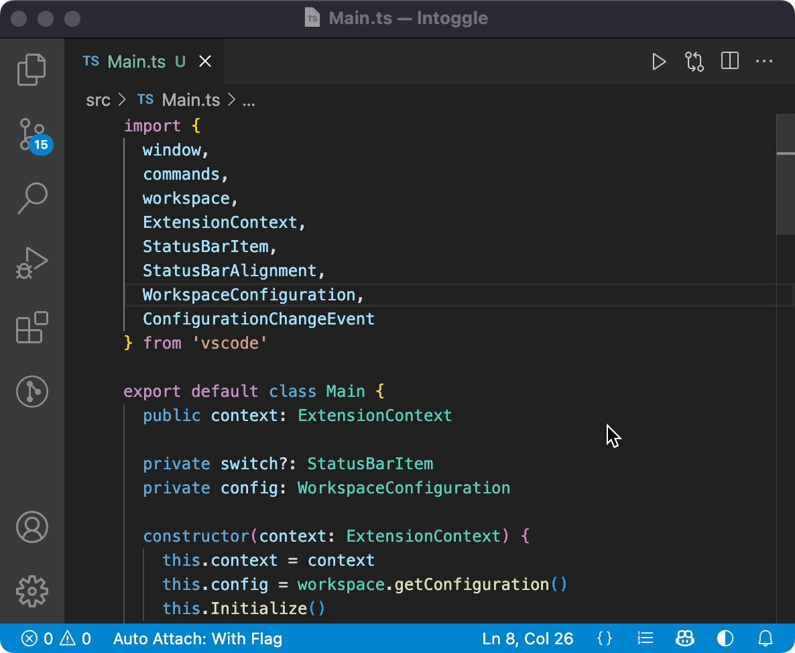

# Line Numbers Toggle

**Line Numbers Toggle** provides a simple way to toggle line numbers on and off by pressing Ctrl + Shift + L or clicking a status bar icon.

[MIT](https://github.com/yay/lntoggle/blob/main/LICENSE) &copy; 2022 [yay]

[yay]: https://github.com/yay
[Theme Switch]: https://marketplace.visualstudio.com/items?itemName=Fooxly.themeswitch
